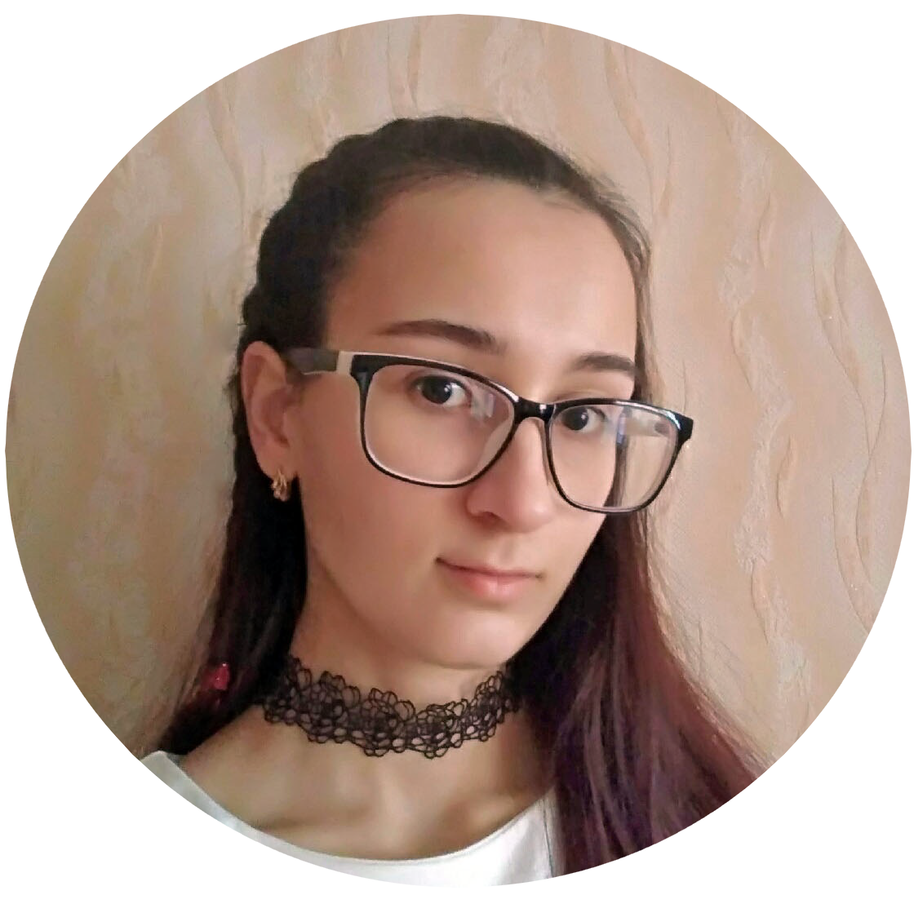

# **Kolesnichenko Anna**
## **Contacts**
    E-mail: sarantail@gmail.com
    Discord: Sarantail(@Sarantail)
## **About me**
My name is Anna Kolesnichenko. I'm a beginner Front-end Developer.\
When I was in school lessons on HTML, I was intrigued by web development. 
Recently I decided to study programming in more detail.\
I've been drawing, so I have a great sense of style and color.
So I decided to choose a direction related to code visualization.
## **Skills**
    HTML
    JavaScript
    Git
## **Code example**
```javascript
function multiply(a, b){
return a * b
}
```
## **Experience**
CV. Markdown & Git
## **Education:**
**University:** The Russian Presidential Academy of National Economy and Public Administration (RANEPA)
## **Languages:**
    1. Russian - Native
    2. English - Elementary/Pre-Intermediate